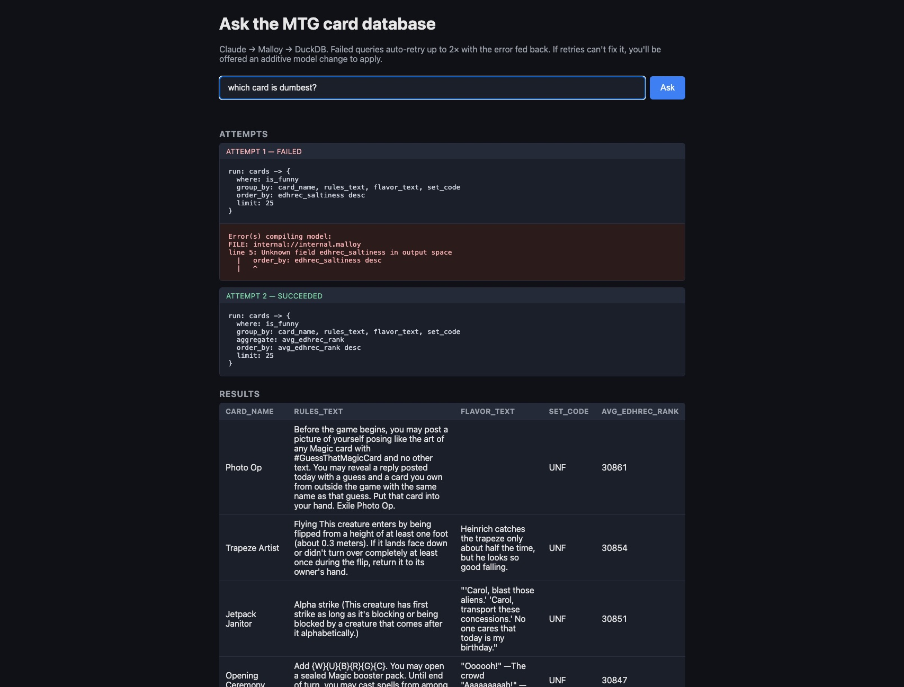

# Malloy Test — MTGJSON Conversational Analytics

A feasibility test for LLM-generated Malloy semantic models plus
natural-language querying. 

Can modern LLMs shorten the time to insight by quickly learning a dataset and creating conversational analytics without any BI tech?  Yes.
This test took roughly an hour, and required zero coding.  The prompts were generated using Claude after I explained my idea.




The stack:

```text
[Browser UI]  ->  [Node proxy]  ->  [Claude API]       (NL → Malloy)
                       |
                       └──────>  [Malloy Publisher]  ->  [DuckDB]  ->  [MTGJSON parquet]
```

## What's in the repo

| Path                       | What it is                                                                         |
|----------------------------|------------------------------------------------------------------------------------|
| `data/`                    | MTGJSON parquet files (`cards.parquet`, `sets.parquet`). **Gitignored.**           |
| `catalog/`                 | ODCS v3 data catalogs documenting the cards and sets schemas.                      |
| `Malloy-source-files/`     | Malloy semantic model + Publisher package manifest.                                |
| `test-ui/`                 | Minimal web UI for NL → Malloy → results via Claude.                               |
| `publisher.config.json`    | Publisher server config (projects → packages).                                     |
| `docs/prompts/`            | Task prompts used to drive each phase.                                             |
| `.env.local`               | `ANTHROPIC_API_KEY=...`. **Gitignored.**                                           |

## Prerequisites

- **DuckDB CLI** (`brew install duckdb`) — for ad-hoc inspection only.
- **Node 18+** — Publisher and the test UI both run on Node.
- **MTGJSON parquet files** in `data/`. Download from
  <https://mtgjson.com/api/v5/AllPrintingsParquetFiles.zip>, unzip, and
  copy `cards.parquet` and `sets.parquet` into `data/`.
- **Anthropic API key** in `.env.local`:

  ```bash
  ANTHROPIC_API_KEY=sk-ant-...
  ```

## Phase 1 — Data load

Parquet files live in `data/`. Validate with DuckDB:

```bash
duckdb -c "SELECT COUNT(*) FROM 'data/cards.parquet';"   # → 109,733
duckdb -c "SELECT COUNT(*) FROM 'data/sets.parquet';"    # → 855
```

## Phase 2 — ODCS catalogs

Data contracts in [catalog/cards.odcs.yaml](catalog/cards.odcs.yaml) and
[catalog/sets.odcs.yaml](catalog/sets.odcs.yaml). These document the
analytically-useful columns (41 of 81 for cards, 16 of 22 for sets) with
business-friendly descriptions, examples, and the
`cards.setCode → sets.code` relationship. They feed the Malloy generation
step and the LLM system prompt.

## Phase 3 — Malloy semantic model

Generated from the ODCS catalogs into
[Malloy-source-files/](Malloy-source-files/):

- `sets.malloy` — sets dimension table with release-date parsing
- `cards.malloy` — cards source, joins to sets, exposes computed
  dimensions (`is_multicolor`, `is_creature`, `color_count`, …) and views
  (`by_rarity`, `by_set`, `color_distribution`, …)
- `queries.malloy` — smoke-test `run:` statements
- `publisher.json` — package manifest for Malloy Publisher

**Important:** List-like MTGJSON columns (`colors`, `types`, `keywords`,
…) are stored as comma-joined `VARCHAR`, not native `LIST` types. The
model uses `~ '%X%'` substring matching, not Malloy's `?` array operator.
The parquet paths inside `sets.malloy` / `cards.malloy` are **absolute**
because Publisher copies packages into `publisher_data/` on load and
relative paths break.

Compile / run with the Malloy CLI:

```bash
npm install -g @malloydata/cli
cd Malloy-source-files && malloy-cli run queries.malloy
```

## Phase 4a — Malloy Publisher

Runs the Malloy model as a REST + MCP service.

```bash
cd "~/repos/Malloy Test"
nohup npx -y @malloy-publisher/server@latest --port 4000 --server_root . \
  > /tmp/publisher.log 2>&1 &
```

- **Web UI / REST API:** <http://localhost:4000>
- **MCP endpoint:** <http://localhost:4040> (JSON-RPC)
- **Stop:** `pkill -f "@malloy-publisher/server"`
- **Logs:** `/tmp/publisher.log`

Query endpoint used by the test UI:

```http
POST /api/v0/projects/mtgjson/packages/mtgjson-analytics/models/cards.malloy/query
body: { "query": "run: cards -> by_rarity", "compactJson": true }
```

If Publisher gets confused after a source-file edit, delete the
copy-on-load directory and restart: `rm -rf publisher_data && <restart>`.

## Phase 4b — Natural-language test UI

Minimal browser UI in [test-ui/](test-ui/):

```bash
cd test-ui
set -a; source ../.env.local; set +a
node server.js
# open http://localhost:5173
```

Flow: browser → `server.js` calls Claude with
[test-ui/system-prompt.txt](test-ui/system-prompt.txt) (which lists every
dimension/measure/view from `cards.malloy`) → Claude emits a Malloy
query → `server.js` POSTs it to Publisher → rows render as a table.

See [test-ui/README.md](test-ui/README.md) for the detailed architecture
and known limitations.

## Phase 5 — Error recovery & model evolution

The test UI includes an automatic retry loop and an experimental model
enhancement flow.

**Retry loop** (in [test-ui/server.js](test-ui/server.js)): when a Malloy
query fails, the server feeds the failed query + error back to Claude
with the "Retry behaviour" section of `system-prompt.txt`, and tries up
to **2 more times** (`MAX_RETRIES`). Every attempt shows up in the UI as
a separate card so you can see how Claude walked back from the error.

**Model enhancement** (in [test-ui/model-enhancer.js](test-ui/model-enhancer.js)):
if all retries still fail with a "field-not-found"–style error, the UI
offers to extend the model. The flow:

1. Server calls Claude in JSON mode with the question, the failed query,
   the error, and the full current contents of `cards.malloy`. Claude
   returns `{ file, changeType, snippet, reasoning }`.
2. The UI shows the proposed snippet + reasoning with **Apply / Skip**
   buttons. Nothing touches disk until you click Apply.
3. On Apply, the server:
   - Backs up the original to `backups/<file>.<timestamp>.bak`.
   - Splices the snippet just before the closing `}` of the source
     extension, with an `-- @ai-added <ts>` marker line.
   - Mirrors the change into `publisher_data/.../cards.malloy` (Publisher
     copies packages on first load and never re-syncs from the source
     dir, so we have to write both locations).
   - Calls `GET /api/v0/projects/mtgjson/packages/mtgjson-analytics?reload=true`
     to make Publisher re-parse.
   - Re-runs the original question through the full ask loop.

**Safety rails:**

- Allowlist: only `cards.malloy` and `sets.malloy` can be edited.
- Hard cap: `MAX_CHANGES_PER_SESSION = 3` per server lifetime — restart
  the UI server to reset.
- Backups are unconditional and timestamped.
- All asks, proposals, and applies are appended to `logs/sessions.jsonl`
  as one JSON record per line.

**Known limitation:** the NL→Malloy system prompt is reloaded fresh on
every `/api/ask` call, but its content (the field list) is **static** —
it doesn't reflect newly-added dimensions. After a successful
enhancement, Claude often re-runs the question successfully via a
*different* path rather than using the new field. To make the new field
reachable in subsequent questions you'd need to either (a) regenerate
`system-prompt.txt` after each apply, or (b) inject "recently-added
fields" into the user message dynamically.

## Phase 6 — Git-tracked model evolution

Every applied model change now creates a real git commit on the current
branch. The flow extends Phase 5:

1. Apply writes the snippet, mirrors to `publisher_data/`, hits reload —
   *and then* runs `git add Malloy-source-files/<file> && git commit` with
   a structured message.
2. The UI shows the short commit hash and subject line in the
   enhancement status, and refreshes the **Model history** panel.
3. **Undo last model change** in the history panel calls `/api/rollback`,
   which:
   - Finds the most recent commit touching `Malloy-source-files/`.
   - Runs `git revert --no-edit <hash>` (creates a new revert commit;
     does not rewrite history).
   - Re-syncs `publisher_data/` from the now-reverted source files.
   - Hits the Publisher reload endpoint.

### Commit message shape

```text
Auto: add_dimension for: "<user question>"

Reasoning: <Claude's explanation>

Code added:
<the snippet>

Error that triggered this:
<the original error message>
```

This makes `git log --oneline -- Malloy-source-files` a readable
chronicle of how the model grew, and `git diff HEAD~3 -- Malloy-source-files`
shows exactly what was added over the last three changes.

### Endpoints

| Method | Path                | Purpose                                 |
|--------|---------------------|-----------------------------------------|
| GET    | `/api/history`      | Last N commits touching the model dir   |
| POST   | `/api/rollback`     | Revert most recent model commit         |
| POST   | `/api/apply`        | Apply change (now also commits)         |

### Safety

- Allowlist still enforced (`cards.malloy`, `sets.malloy` only).
- `MAX_CHANGES_PER_SESSION` cap unchanged (3 per server lifetime).
- Backups in `backups/` are still written even though git also has the
  history — they're a belt-and-suspenders for the publisher_data copy.
- Rollback uses `git revert` (additive) not `git reset` (history rewrite).
- All git operations are scoped to the repo root via `execFileSync`
  with explicit `cwd`; no shell interpolation.

## Ports used

| Service          | Port | URL                     |
|------------------|------|-------------------------|
| Malloy Publisher | 4000 | <http://localhost:4000> |
| Publisher MCP    | 4040 | <http://localhost:4040> |
| Test UI proxy    | 5173 | <http://localhost:5173> |

## Known data quirks

- `cards.name` is **not unique** — one row per printing, so Lightning
  Bolt appears dozens of times. Use `uuid` for row identity and
  `count(name)` for distinct cards.
- `avg(manaValue)` on `rarity = 'rare'` looks inflated (~51) due to
  legacy/X-cost entries in MTGJSON. Data artifact, not a query bug.
- Many columns are nullable booleans — `WHERE x = false` silently drops
  nulls.
- Promo / The List / Secret Lair sets contain reprints with unusual
  rarities that skew rarity-distribution analysis.
